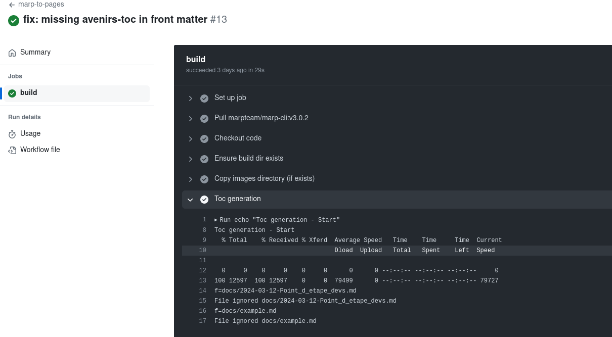

# Development presentations
This Github project aim contains the developpers presentations. 

## Technologies
The presentations are written in <a href="https://www.markdownguide.org/cheat-sheet/" target="_blank">Markdown</a> and use <a href="https://pages.github.com/" target="_blank">Github pages</a>, <a href="https://docs.github.com/fr/actions" target="_blank">Github actions</a> and <a href="https://marp.app/" target="_blank"> Marp</a>.

## New presentations
The new presentations should be created under the directory docs.<br/>
A TOC can be generated in a presentation by inserting the comments:
```
<!--ts-->
<!--te-->
```
The title for level 1 an 2 will be used to generate the table of content via the utilitary 
<a href="https://github.com/ekalinin/github-markdown-toc" target="_blank"> github-markdown-toc</a>.
gh-md-toc is executed vi the Github actions, step Toc generation. If the file does not contain the comments for the toc it is ignored (this an be traced in the github actions outputs).


*Toc generation output in Github actions*

## Presentations list.
A main TOC (a presentations list) is generated an inserted in the index file via the Github actions. It uses the script [generate-toc.sh](https://github.com/avenirs-esr/presentations/blob/c78d67f3ce3eaa1c33e7458a8cb6a57f60d84f6a/scripts/generate-toc.sh). 

The insertion slot is determined by the comment
`<!-- {{TOC}} -->` in the file index.template.md.
