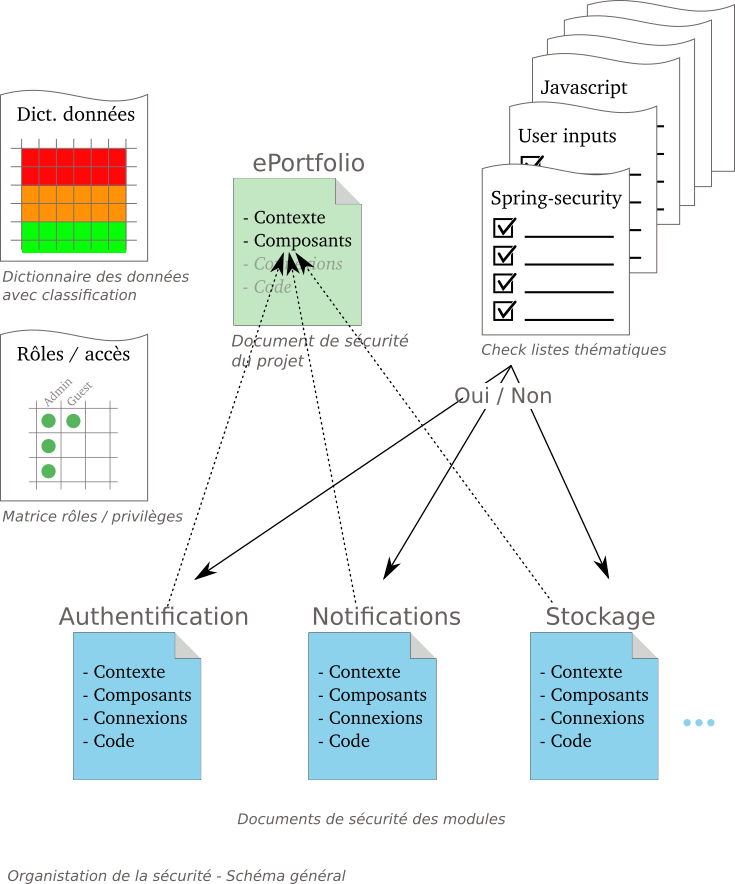

# **Focus sur la sécurité**

***16/04/2024***

Julien Gribonvald - Coordinateur Technique ESUP
Arnaud Deman - Architecte et développeur ESUP

---
## Sécurité & confidentialité : contexte

* Problématiques qui ne peuvent plus être traitées à la marge.
* Caratéristiques du projet :
    - Mode SASS / hybride, cadre national.
    - Projet complexe.
    - Forte population d'utilisateurs potentiels.
    - De nombreuses interactions avec des services extérieurs.
  
* Domaine vaste et complexe : un effort de **formalisation nécessaire.**
* Actualisation des connaissances : 
  - [OWASP](https://owasp.org/) : Open Worldwide Application Security Project.
  - [ANNSI](https://cyber.gouv.fr/decouvrir-lanssi) : Agence nationale de la sécurité des systèmes d'information.
  - ...

---

## Security by design
  - Prise en compte de la sécurité dès la conception et à chaque phase du projet. 
  - Repose sur un certain nombre de grands principes : surface d'attaque, moindre privilèges, défense en profondeur, etc.
  - Mise en place de procédures documentées.
  - Puis implémentées : revues de code, vérifications automatiques, etc.
  - ... et révisées régulièrement.
  - Processus d'amélioration continue.
  - Golden Path : baliser au mieux la voie pour atteindre l'objectif.
---

## Mise en oeuvre
- Procédure en cours d'élaboration.
- Documents de sécurité : niveau projet & grands modules fonctionnels.
  - Contexte, surface d'attaque, technologies, etc.
- Documents transversaux : 
  - Dictionnaire des données classifiées par niveau de criticité.
  - Matrices des droits / rôles.
  - Check listes thématiques.
  
---
## Schéma général

---

<!--
header: Ressources
-->
## [Pour tout savoir](https://avenirs-esr.github.io/dev-doc/)

### https://avenirs-esr.github.io/dev-doc/
