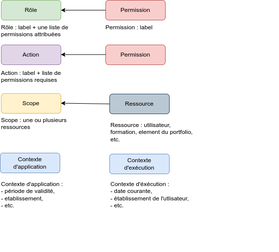
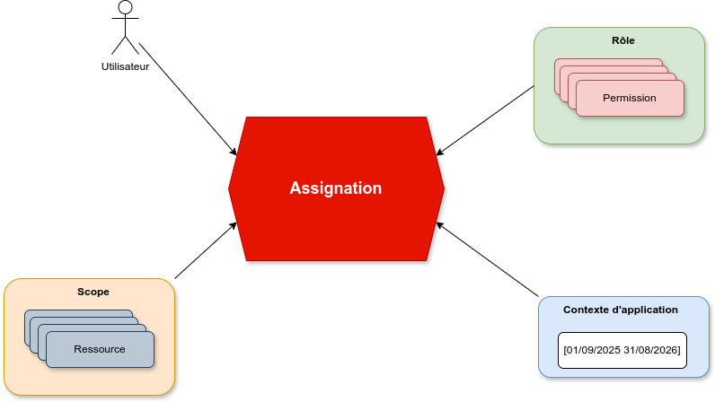
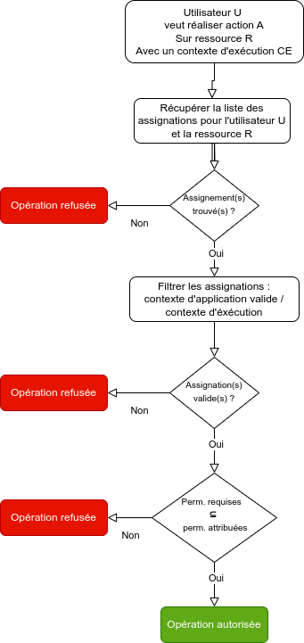
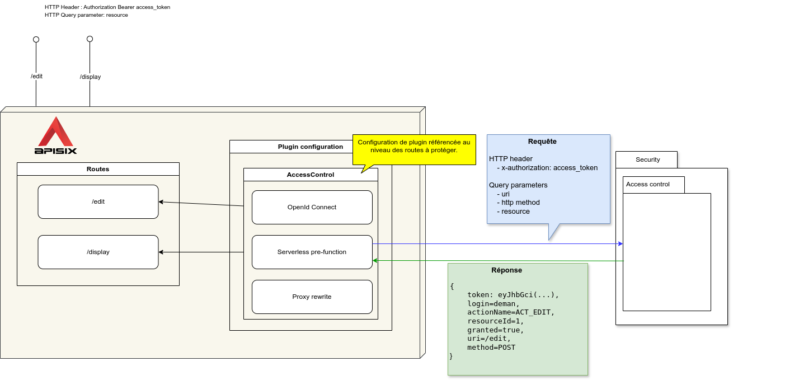

# *Contrôle d'accès**

***19/07/2024***

Arnaud Deman - Architecte et développeur ESUP

---
## Sécurité & contrôle d'accès : contexte

* Enjeu de sécurité fort au niveau du projet (c.f. [security/privacy by design](2024-04-16-Pres-AD-et-privacy-by-design.md)).
* Besoin d'avoir une gestion fine des droits, e.g. un pair doit pouvoir accéder en lecture à une rubrique d'un portfolio, écrire des commentaires, pour une période de temps donnée.
* S'appuyer sur un modèle éprouvé et compréhensible.
* Doit s'interfacer avec l'API manager.
* Système très sollicité : doit être très **réactif**
* Doit permettre de répondre à différentes questions :
  * L'utilisateur U est-il autorisé à exécuter l'action A concernant la ressource R à un instance t ?
  * Lister les rôles et permissions d'un utilisateur.
  * Lister les utilisateurs autorisés à exécuter une action sur une resource.

---

## Role Based Access Control : RBAC
  - Modèle de sécurité classique et éprouvé.
  - Peut-être étendu, dans notre cas on ajoute la notion de contexte : période de validité, établissement, etc.
  - Dans un premier temps, le choix qui est fait est de développer un système de contrôle d'accès qui réponde spécifiquement aux besoins du projet. L'utilisation d'une solution intégrée de type IAM telle que celle proposée par keycloak nous paraît introduire trop de complexité (synchronisation des ressources) et une dépendance à un éditeur peu souhaitable sur un élément aussi central.
---

## RBAC : les concepts

---
## RBAC : focus sur l'assignation 

  
L'objet d'assignation est l'élément qui permet de déterminer si un utilisateur est autorisé à réaliser une action à un instant t.
---
## RBAC : algorithme 

## Intégration avec APISIX 
  

* Configuration de plugin réutilisable : 
  - [Exemple de configuration](https://github.com/avenirs-esr/srv-dev/blob/2105f8428cff5b7bd904db9118a67a786c6887ab/services/apisix/scripts/routes/experiments/access_control_plugin.curl.sh)
  - [Exemple d'utilisation au niveau d'une route](https://github.com/avenirs-esr/srv-dev/blob/2105f8428cff5b7bd904db9118a67a786c6887ab/services/apisix/scripts/routes/experiments/access_control-edit.curl.sh)
* Nécessité de faire le lien entre action et requête http (URI + méthode)

---
## TODO
* Implémentation de la notion de contexte (d'application et d'exécution).
* Valider la modélisation : utilisation de labels, pas de hiérarchie.
* Access token dans les tests unitaires, comment faire ? [exemple](https://github.com/avenirs-esr/avenirs-portfolio-security/blob/0ae2222b83ea6cb62fe6e6a4f5505d3f5ed49a6c/src/test/java/fr/avenirsesr/portfolio/security/controllers/AccessControlControllerTest.java)
* Test de couverture.
* Test de charge -> Jmeter ?
* Cohérence des noms de packages / dossier d'architecture.
* Implémentation des autres méthodes de gestion, dont la liste est à déterminer. Par exemple: 
  * lister les roles/permissions d'un utilisateur
  * lister les utilisateurs associés à un rôle, 
  * etc.

## Documentation développeur (Modèle de donnée et fixtures pour les tests) 

[Dossier d'architecture / sécurité](https://avenirs-esr.github.io/dev-doc/arch-soft-specif-security/)

### https://avenirs-esr.github.io/dev-doc/arch-soft-specif-security/
